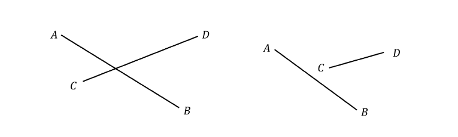
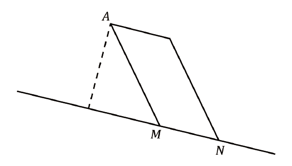
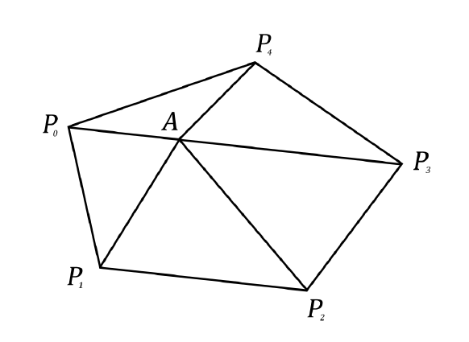
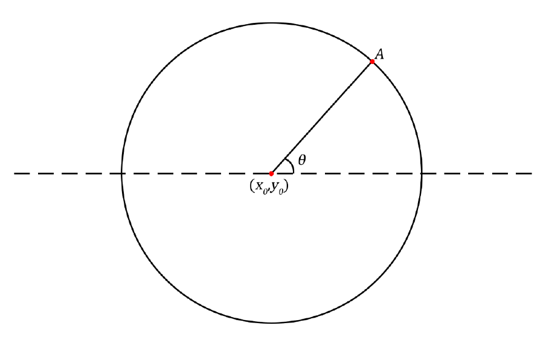
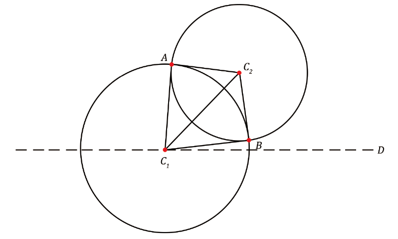

#  计算几何

> `@Artiprocher` 段忠杰
>
> `@tieway59` 伍泰炜

## 0. 关于如何整理

我觉得一个学习路径大概可以归纳为一下几个步骤：

1. 摘抄一遍基本的**数学概念**。
2. 摘抄一遍基本的**数学公式**。
3. 整理出一份自己习惯的**基础函数与结构体**。
4. 开始遍历清单寻找一个**典型问题**。
   1. 如果你没有清单
   2. 找一些竞赛大佬
   3. 搜他博客的标签
   4. 看都是什么算法
5. 找最优解，**修改**成自己的风格。
   1. 如果实在不懂
   2. 至少先会用吧
6. 反复提交，验证代码的**正确性**。
7. 保存代码，注释**复杂度**与**条件**。
8. 返回继续执行第4步。
9. 感觉自己积累的差不多了，开始做做综合题实战一下。

本贴继承自段老师的讲义，主要集中在的基本的数学概念，和数学公式方面。

文章最后有贴出一个清单，具体算法愿大家都能自行整理。

熟悉自己的模板，尽量保证风格一致。

自己整理是一个非常重要的过程。

真正赛场上的难题，往往非常综合，也很考验数学功底，这种只能看大家平时的积累和思维的广度了。

## 1. 向量的基本运算

### 1.1 点和向量的表示

在平面直角坐标系中，任意一点的坐标可以用一个有序数对 $(x,y)$ 表示，向量也是如此

```cpp
struct Point//点或向量
{
    double x, y;
    Point() {}
    Point(double x, double y) :x(x), y(y) {}
};
typedef Point Vector;
```

### 1.2 基本向量运算

设向量 $v_1=(x_1,y_1),v_2=(x_2,y_2)$ ，定义如下运算

#### 1.2.1 向量加法

$$
v_1+v_2=(x_1+x_2,y_1+y_2)
$$

#### 1.2.2 向量减法

$$
v_1-v_2=(x_1-x_2,y_1-y_2)
$$

若 $P=(x_1,y_1),Q=(x_2,y_2)$ ，则 $\overrightarrow{PQ}=Q-P=(x_2-x_1,y_2-y_1)$ 

#### 1.2.3 向量模长

$$
|v_1|=\sqrt{x_1^2+y_1^2}
$$

向量模长可以用来求两点间的距离

#### 1.2.4 向量数乘

$$
av_1=(ax_1,ay_1),a\in \mathbb{R}
$$

向量数乘可以实现向量的长度伸缩

#### 1.2.5 向量内积（点积）

$$
v_1\cdot v_2=|v_1||v_2|\cos<v_1,v_2>=x_1x_2+y_1y_2
$$

$v_1\cdot v_2=0$ 当且仅当 $v_1\perp v_2$

向量内积可以用来求向量间的夹角

#### 1.2.6 向量外积（叉积）

这个定义可能来自张量（Tensor）代数
$$
v_1\times v_2=\begin{vmatrix}
x_1 & y_1\\
x_2 & y_2
\end{vmatrix}=x_1y_2-x_2y_1
$$

$$
|v_1\times v_2|=|v_1||v_2|\sin <v_1,v_2>
$$

外积是很重要的一个概念，有很多应用

外积可以用来求面积，以 $v_1,v_2$ 为邻边的平行四边形面积为 $|v_1\times v_2|$ 

$v_1\times v_2=0$ 当且仅当 $v_1\parallel v_2$ 

外积可以用来判断向量间的位置关系，若 $v_1$ 旋转到 $v_2$ 的方向为顺时针，则 $v_1\times v_2<0$ ，反之 $v_1\times v_2>0$ 

#### 1.2.7 向量旋转

向量 $v_1$ 逆时针旋转 $\theta$ 后的坐标满足
$$
\begin{cases}
x'=x_1\cos \theta-y_1\sin \theta\\
y'=x_1\sin \theta+y_1\cos \theta
\end{cases}
$$

```cpp
#include <bits/stdc++.h>
using namespace std;
const double eps = 1e-6;//eps用于控制精度
const double pi = acos(-1.0);//pi
struct Point//点或向量
{
    double x, y;
    Point() {}
    Point(double x, double y) :x(x), y(y) {}
};
typedef Point Vector;
Vector operator + (Vector a, Vector b)//向量加法
{
    return Vector(a.x + b.x, a.y + b.y);
}
Vector operator - (Vector a, Vector b)//向量减法
{
    return Vector(a.x - b.x, a.y - b.y);
}
Vector operator * (Vector a, double p)//向量数乘
{
    return Vector(a.x*p, a.y*p);
}
Vector operator / (Vector a, double p)//向量数除
{
    return Vector(a.x / p, a.y / p);
}
int dcmp(double x)//精度三态函数(>0,<0,=0)
{
    if (fabs(x) < eps)return 0;
    else if (x > 0)return 1;
    return -1;
}
bool operator == (const Point &a, const Point &b)//向量相等
{
    return dcmp(a.x - b.x) == 0 && dcmp(a.y - b.y) == 0;
}
double Dot(Vector a, Vector b)//内积
{
    return a.x*b.x + a.y*b.y;
}
double Length(Vector a)//模
{
    return sqrt(Dot(a, a));
}
double Angle(Vector a, Vector b)//夹角,弧度制
{
    return acos(Dot(a, b) / Length(a) / Length(b));
}
double Cross(Vector a, Vector b)//外积
{
    return a.x*b.y - a.y*b.x;
}
Vector Rotate(Vector a, double rad)//逆时针旋转
{
    return Vector(a.x*cos(rad) - a.y*sin(rad), a.x*sin(rad) + a.y*cos(rad));
}
double Distance(Point a, Point b)//两点间距离
{
    return sqrt((a.x - b.x)*(a.x - b.x) + (a.y - b.y)*(a.y - b.y));
}
double Area(Point a, Point b, Point c)//三角形面积
{
    return fabs(Cross(b - a, c - a) / 2);
}
```

## 2. 直线与线段

### 2.1 线段相交问题



线段 $AB$ 与 $CD$ 相交（不考虑端点）的充分必要条件是
$$
(\overrightarrow{CA}\cdot \overrightarrow{CB})
(\overrightarrow{DA}\cdot \overrightarrow{DB})<0,
(\overrightarrow{AC}\cdot \overrightarrow{AD})
(\overrightarrow{BC}\cdot \overrightarrow{BD})<0
$$

```cpp
bool Intersect(Point A, Point B, Point C, Point D)//线段相交（不包括端点）
{
    double t1 = Cross(C - A, D - A)*Cross(C - B, D - B);
    double t2 = Cross(A - C, B - C)*Cross(A - D, B - D);
    return dcmp(t1) < 0 && dcmp(t2) < 0;
}
bool StrictIntersect(Point A, Point B, Point C, Point D) //线段相交（包括端点）
{
    return
        dcmp(max(A.x, B.x) - min(C.x, D.x)) >= 0
        && dcmp(max(C.x, D.x) - min(A.x, B.x)) >= 0
        && dcmp(max(A.y, B.y) - min(C.y, D.y)) >= 0
        && dcmp(max(C.y, D.y) - min(A.y, B.y)) >= 0
        && dcmp(Cross(C - A, D - A)*Cross(C - B, D - B)) <= 0
        && dcmp(Cross(A - C, B - C)*Cross(A - D, B - D)) <= 0;
}
```

### 2.2 点到直线的距离



如图所示，要计算点A到直线MN的距离，可以构建以AM，MN为邻边的平行四边形，其面积
$$
S=|\overrightarrow{MA}\times \overrightarrow{MN}|
$$
平行四边形的面积为底乘高，选取MN为底，高为
$$
d=\frac{S}{\left|\overrightarrow{MN}\right|}
$$
即为所求的A到直线MN的距离

```cpp
double DistanceToLine(Point A, Point M, Point N)//点A到直线MN的距离,Error:MN=0
{
    return fabs(Cross(A - M, A - N) / Distance(M, N));
}
```

### 2.3 两直线交点

在实际应用中，通常的已知量是直线上某一点的坐标和直线的方向向量，对于两直线 $l_{1}$,$\ l_{2}$ ,设 $P\left( x_{1},y_{1} \right)$ , $\text{Q}\left( x_{2},y_{2} \right)$ 分别在 $l_{1}$ , $\ l_{2}$ 上， $l_{1}$ , $\ l_{2}$ 的方向向量分别为 $v = \left( a_{1},b_{1} \right)$ , $w = \left( a_{2},b_{2} \right)$ ,由此可以得到两直线的方程
$$
l_{1}:\left( x - x_{1},y - y_{1} \right) \times \left( a_{1},b_{1} \right) = 0
$$

$$
l_{2}:\left( x - x_{2},y - y_{2} \right) \times \left( a_{2},b_{2} \right) = 0
$$

即
$$
l_{1}:a_{1}x - b_{1}y = a_{1}x_{1} - b_{1}y_{1}
$$

$$
l_{2}:a_{2}x - b_{2}y = a_{2}x_{2} - b_{2}y_{2}
$$

联立两直线的方程，由克拉默法则得，方程组的解为
$$
\left\{ \begin{matrix}
x = \frac{\left| \begin{matrix}
a_{1}x_{1} - b_{1}y_{1} & - b_{1} \\
a_{2}x_{2} - b_{2}y_{2} & - b_{2} \\
\end{matrix} \right|}{\left| \begin{matrix}
a_{1} & - b_{1} \\
a_{2} & - b_{2} \\
\end{matrix} \right|} \\
y = \frac{\left| \begin{matrix}
a_{1} & a_{1}x_{1} - b_{1}y_{1} \\
a_{2} & a_{2}x_{2} - b_{2}y_{2} \\
\end{matrix} \right|}{\left| \begin{matrix}
a_{1} & - b_{1} \\
a_{2} & - b_{2} \\
\end{matrix} \right|} \\
\end{matrix} \right.\
$$
进一步进行化简，得到
$$
(x,y)=P+v\cdot \frac{w\times u}{v\times w}
$$
其中 $u=-\overrightarrow{PQ}$ 

```cpp
Point GetLineIntersection(Point P, Vector v, Point Q, Vector w)//两直线的交点
{
    Vector u = P - Q;
    double t = Cross(w, u) / Cross(v, w);
    return P + v * t;
}
```

## 3. 多边形

### 3.1 点和多边形的位置关系

设有（凸）$n(n≥3)$ 边形 $P_0 P_2\dots P_{n-1}$，点的顺序为顺时针或逆时针，以及点A，记
$$
\theta_{i} = \left\{ \begin{matrix}
 < \overrightarrow{AP_{i}},\overrightarrow{AP_{i + 1}} > ,i < n - 1 \\
 < \overrightarrow{AP_{n - 1}},\overrightarrow{AP_{0}} > ,i = n - 1 \\
\end{matrix} \right.\ 
$$


点在多边形内等价于
$$
\sum_{i = 0}^{n - 1}\theta_{i} = 2\pi
$$

```cpp
/*模板说明：P[]为多边形的所有顶点，下标为0~n-1，n为多边形边数*/
Point P[1005];
int n;
bool InsidePolygon (Point A) //判断点是否在凸多边形内（角度和判别法）
{
    double alpha = 0;
    for (int i = 0; i < n; i++)
        alpha += fabs(Angle(P[i] - A, P[(i + 1) % n] - A));
    return dcmp(alpha - 2 * pi) == 0;
}

// STL：求多边形面积（叉积和计算法）
double PolygonArea(const vector <Point> &P) {
    int n = P.size();
    // assert(n > 2);
    double sum = 0;
    Point O = Point(0, 0);
    for (int i = 0; i < n; i++)
        sum += Cross(P[i] - O, P[(i + 1) % n] - O);
    if (sum < 0) sum = -sum;
    return sum / 2;
}
```

### 3.2 多边形的面积

设有（凸）$n(n≥3)$ 边形 $P_0 P_2\dots P_{n-1}$ ，点的顺序为顺时针或逆时针，以及多边形内一点A，把多边形切割成如下所示n个三角形



多边形的面积等于所有三角形（有向）面积之和，代入坐标 $P_i (x_i,y_i ),i=0,1,\dots,n-1$ 计算得 
$$
S = \left| \frac{1}{2}\sum_{i = 0}^{n - 2}\left( x_{i}y_{i + 1} - x_{i + 1}y_{i} \right) + \frac{1}{2}\left( x_{n - 1}y_{0} - x_{0}y_{n - 1} \right) \right|
$$
与A的坐标无关，因此A可任取，甚至可取在多边形外，通常为计算方便，取A为坐标原点

```cpp
/*模板说明：P[]为多边形的所有顶点，下标为0~n-1，n为多边形边数*/
Point P[1005];
int n;
double PolygonArea()//求多边形面积（叉积和计算法）
{
    double sum = 0;
    Point O = Point(0, 0);
    for (int i = 0; i < n; i++)
        sum += Cross(P[i] - O, P[(i + 1) % n] - O);
    if (sum < 0)sum = -sum;
    return sum / 2;
}
```

## 4. 圆

### 4.1 圆的参数方程



以$(x_{0},y_{0})$为圆心，$r$为半径的圆的参数方程为
$$
\left\{ \begin{matrix}
x = x_{0} + r\cos\theta \\
y = y_{0} + r\sin\theta \\
\end{matrix} \right.\
$$
根据圆上一点和圆心连线与$x$轴正向的夹角可求得该点的坐标

### 4.2 两圆交点



设两圆$C_{1},C_{2}$，其半径为$r_{1},r_{2}(r_{1} \geq r_{2})$，圆心距为$d$，则有

①两圆重合$\Longleftrightarrow d = 0\ \ r_{1} = r_{2}$

②两圆外离$\Longleftrightarrow d > r_{1} + r_{2}$

③两圆外切$\Longleftrightarrow d = r_{1} + r_{2}$

④两圆相交$\Longleftrightarrow r_{1} - r_{2} < d < r_{1} + r_{2}$

⑤两圆内切$\Longleftrightarrow d = r_{1} - r_{2}$

⑥两圆内含$\Longleftrightarrow d < r_{1} - r_{2}$

对于情形④，如下图所示，要求A与B的坐标，只需求$\angle AC_{1}D$与$\angle BC_{1}D$，进而通过圆的参数方程即可求得
$$
\angle AC_{1}D = \angle C_{2}C_{1}D + \angle AC_{1}C_{2}
$$

$$
\angle BC_{1}D = \angle C_{2}C_{1}D - \angle AC_{1}C_{2}
$$

$\angle C_{2}C_{1}D$可以通过$C_{1},C_{2}$的坐标求得，而$\angle AC_{1}C_{2}$可以通过$\Delta AC_{1}C_{2}$上的余弦定理求得

对于情形③和情形⑤，上述方法求得的两点坐标是相同的，即为切点的坐标

```cpp
struct Circle
{
    Point c;
    double r;
    Point point(double a)//基于圆心角求圆上一点坐标
    {
        return Point(c.x + cos(a)*r, c.y + sin(a)*r);
    }
};
double Angle(Vector v1)
{
    if (v1.y >= 0)return Angle(v1, Vector(1.0, 0.0));
    else return 2 * pi - Angle(v1, Vector(1.0, 0.0));
}
int GetCC(Circle C1, Circle C2)//求两圆交点
{
    double d = Length(C1.c - C2.c);
    if (dcmp(d) == 0)
    {
        if (dcmp(C1.r - C2.r) == 0)return -1;//重合
        else return 0;
    }
    if (dcmp(C1.r + C2.r - d) < 0)return 0;
    if (dcmp(fabs(C1.r - C2.r) - d) > 0)return 0;
 
    double a = Angle(C2.c - C1.c);
    double da = acos((C1.r*C1.r + d * d - C2.r*C2.r) / (2 * C1.r*d));
    Point p1 = C1.point(a - da), p2 = C1.point(a + da);
    if (p1 == p2)return 1;
    else return 2;
}
```

`// 从这里开始更新`

### 4.3 不共线三点求圆心（外心）

设圆的方程：
$$
(x - x_0)^2 + (y - y_0)^2 = r^2
$$
然后带入三个点：
$$
\begin{cases}
(x_1 - x_0)^2 + (y_1-y_0)^2 = r^2 & (1)\\
(x_2 - x_0)^2 + (y_2-y_0)^2 = r^2 & (2)\\
(x_3 - x_0)^2 + (y_3-y_0)^2 = r^2 & (3)
\end{cases}
$$

通过带入和化简，最后可以这样求：
$$
\begin{align}
a &= x_1-x_2\\
b &= y_1-y_2\\
c &= x_1-x_3\\
d &= y_1-y_3\\
e &= (x_1^2 - x_2^2 + y_1^2 - y_2^2)\div 2\\
f &= (x_1^2 - x_3^2 + y_1^2 - y_3^2)\div 2 \\
\\
x_0 &= \frac{d e - b f}{a d - b c}\\
y_0 &= \frac{a f - c e}{a d - b c}
\end{align}
$$
```cpp
template<typename tp>
inline tp pow2(const tp &x) {
    return x * x;
}

inline Point circumcenter(Point p1, Point p2, Point p3) {
    double a = p1.x - p2.x;
    double b = p1.y - p2.y;
    double c = p1.x - p3.x;
    double d = p1.y - p3.y;
    double e = (pow2(p1.x) - pow2(p2.x) +
                pow2(p1.y) - pow2(p2.y)) / 2;
    double f = (pow2(p1.x) - pow2(p3.x) +
                pow2(p1.y) - pow2(p3.y)) / 2;
    return Point((d * e - b * f) /
                 (a * d - b * c),
                 (a * f - c * e) /
                 (a * d - b * c));
}
```

如果你眼力强大：

```cpp
Point circumcenter(Point a, Point b, Point c) {
    Point res;
    res.x = ((a.x * a.x - b.x * b.x + a.y * a.y - b.y * b.y) * (a.y - c.y) -
             (a.x * a.x - c.x * c.x + a.y * a.y - c.y * c.y) * (a.y - b.y)) /
            (2 * (a.y - c.y) * (a.x - b.x) - 2 * (a.y - b.y) * (a.x - c.x));
    res.y = ((a.x * a.x - b.x * b.x + a.y * a.y - b.y * b.y) * (a.x - c.x) -
             (a.x * a.x - c.x * c.x + a.y * a.y - c.y * c.y) * (a.x - b.x)) /
            (2 * (a.y - b.y) * (a.x - c.x) - 2 * (a.y - c.y) * (a.x - b.x));
    return res;
}
```

### 4.4 最小圆覆盖

```cpp
/**
 *  @Source: https://www.luogu.com.cn/problem/solution/P1742
 *  @Author: snowbody -> tieway59
 *  @Description:
 *      时间复杂度 O(N)
 *      为了减少中途过度开根，距离都是先按照平方计算的。
 *
 *  @Example:
 *      vector<Point> p(n);
 *      for (auto &pi : p) cin >> pi;
 *      Circle circle;
 *      MinCircleCover(p, circle);
 *
 *      6
 *      8.0 9.0
 *      4.0 7.5
 *      1.0 2.0
 *      5.1 8.7
 *      9.0 2.0
 *      4.5 1.0
 *      // r = 5.0000000000 (5.0000000000,5.0000000000)
 *
 *  @Verification:
 *      https://www.luogu.com.cn/problem/P1742
 */


//点或向量 (iostream选择性抄写)
struct Point {
    double x, y;

    Point() {}

    Point(double x, double y) : x(x), y(y) {}

    friend ostream &operator<<(ostream &ut, Point &r) { return ut << r.x << " " << r.y; }

    friend istream &operator>>(istream &in, Point &r) { return in >> r.x >> r.y; }
};

typedef Point Vector;

inline Vector operator+(Vector a, Vector b) {
    return Vector(a.x + b.x, a.y + b.y);
}

inline Vector operator-(Vector a, Vector b) {
    return Vector(a.x - b.x, a.y - b.y);
}

//向量数乘
inline Vector operator*(Vector a, double p) {
    return Vector(a.x * p, a.y * p);
}

//向量数除
inline Vector operator/(Vector a, double p) {
    return Vector(a.x / p, a.y / p);
}

//两点间距离
inline double Distance(Point a, Point b) {
    return sqrt((a.x - b.x) * (a.x - b.x) + (a.y - b.y) * (a.y - b.y));
}

inline double Distance2(Point a, Point b) {
    return ((a.x - b.x) * (a.x - b.x) + (a.y - b.y) * (a.y - b.y));
}

struct Circle {
    Point c;
    double r;

    Point point(double a)//基于圆心角求圆上一点坐标
    {
        return Point(c.x + cos(a) * r, c.y + sin(a) * r);
    }
};

template<typename tp>
inline tp pow2(const tp &x) {
    return x * x;
}

inline Point circumcenter(Point p1, Point p2, Point p3) {
    double a = p1.x - p2.x;
    double b = p1.y - p2.y;
    double c = p1.x - p3.x;
    double d = p1.y - p3.y;
    double e = (pow2(p1.x) - pow2(p2.x) +
                pow2(p1.y) - pow2(p2.y)) / 2;
    double f = (pow2(p1.x) - pow2(p3.x) +
                pow2(p1.y) - pow2(p3.y)) / 2;
    return Point((d * e - b * f) /
                 (a * d - b * c),
                 (a * f - c * e) /
                 (a * d - b * c));
}


void MinCircleCover(vector <Point> &p, Circle &res) {
    int n = p.size();
    random_shuffle(p.begin(), p.end());
    // avoid *sqrt* too much killing your precision.
    for (int i = 0; i < n; i++) {
        if (Distance2(p[i], res.c) <= res.r) continue;
        res.c = p[i];
        res.r = 0;
        for (int j = 0; j < i; j++) {
            if (Distance2(p[j], res.c) <= res.r)continue;
            res.c = (p[i] + p[j]) / 2;
            res.r = Distance2(p[j], res.c);
            for (int k = 0; k < j; k++) {
                if (Distance2(p[k], res.c) <= res.r)continue;
                res.c = circumcenter(p[i], p[j], p[k]);
                res.r = Distance2(p[k], res.c);
            }
        }
    }
    res.r = sqrt(res.r);
}

void solve(int kaseId = -1) {
    int n;
    cin >> n;
    vector <Point> p(n);
    for (auto &pi : p) cin >> pi;
    Circle circle;
    MinCircleCover(p, circle);
    cout << fixed << setprecision(10) << circle.r << endl;
    cout << circle.c.x << " " << circle.c.y << endl;
}
```

##  5. 几何公式

### 5.1 三角形

1. 半周长` P=(a+b+c)/2`

2. 面积 `S=aHa/2=absin(C)/2=sqrt(P(P-a)(P-b)(P-c))`

3. 中线 `Ma=sqrt(2(b^2+c^2)-a^2)/2=sqrt(b^2+c^2+2bccos(A))/2`

4. 角平分线 `Ta=sqrt(bc((b+c)^2-a^2))/(b+c)=2bccos(A/2)/(b+c)`

5. 高线 `Ha=bsin(C)=csin(B)=sqrt(b^2-((a^2+b^2-c^2)/(2a))^2)`

6. 内切圆半径 `r=S/P=asin(B/2)sin(C/2)/sin((B+C)/2)`

​        =`4Rsin(A/2)sin(B/2)sin(C/2)=sqrt((P-a)(P-b)(P-c)/P)`

​        =`Ptan(A/2)tan(B/2)tan(C/2)`

7. 外接圆半径 `R=abc/(4S)=a/(2sin(A))=b/(2sin(B))=c/(2sin(C))`

### 5.2 四边形

D1,D2为对角线,M对角线中点连线,A为对角线夹角

1. `a^2+b^2+c^2+d^2=D1^2+D2^2+4M^2`

2. `S=D1D2sin(A)/2`

(以下对圆的内接四边形)

3. `ac+bd=D1D2`

4. `S=sqrt((P-a)(P-b)(P-c)(P-d))` , P为半周长

### 5.3 正n边形

R为外接圆半径,r为内切圆半径

1. 中心角 `A=2PI/n`

2. 内角 `C=(n-2)PI/n`

3. 边长 `a=2sqrt(R^2-r^2)=2Rsin(A/2)=2rtan(A/2)`

4. 面积 `S=nar/2=nr^2tan(A/2)=nR^2sin(A)/2=na^2/(4tan(A/2))`

### 5.4 圆

1. 弧长 `l=rA`

2. 弦长 `a=2sqrt(2hr-h^2)=2rsin(A/2)`

3. 弓形高 `h=r-sqrt(r^2-a^2/4)=r(1-cos(A/2))=atan(A/4)/2`

4. 扇形面积 `S1=rl/2=r^2A/2`

5. 弓形面积 `S2=(rl-a(r-h))/2=r^2(A-sin(A))/2`

### 5.5 棱柱

1. 体积 `V=Ah`,A为底面积,h为高

2. 侧面积 `S=lp` ,l为棱长,p为直截面周长

3. 全面积 `T=S+2A`

### 5.6 棱锥

1. 体积 `V=Ah/3`,A为底面积,h为高

(以下对正棱锥)

2. 侧面积 `S=lp/2`,l为斜高,p为底面周长

3. 全面积 `T=S+A`

### 5.7 棱台

1. 体积 `V=(A1+A2+sqrt(A1A2))h/3`,A1.A2为上下底面积,h为高

(以下为正棱台)

2. 侧面积 `S=(p1+p2)l/2`,p1.p2为上下底面周长,l为斜高

3. 全面积 `T=S+A1+A2`

### 5.8 圆柱

1. 侧面积 `S=2PIrh`

2. 全面积 `T=2PIr(h+r)`

3. 体积 `V=PIr^2h`

### 5.9 圆锥

1. 母线 `l=sqrt(h^2+r^2)`

2. 侧面积 `S=PIrl`

3. 全面积 ` T=PIr(l+r)`

4. 体积 `V=PIr^2h/3`

### 5.10 圆台

1. 母线` l=sqrt(h^2+(r1-r2)^2)`

2. 侧面积 `S=PI(r1+r2)l`

3. 全面积 `T=PIr1(l+r1)+PIr2(l+r2)`

4. 体积 `V=PI(r1^2+r2^2+r1r2)h/3`

### 5.11 球

1. 全面积 `T=4PIr^2`

2. 体积 `V=4PIr^3/3`

### 5.12 球台

1. 侧面积 `S=2PIrh`

2. 全面积 `T=PI(2rh+r1^2+r2^2)`

3. 体积 `V=PIh(3(r1^2+r2^2)+h^2)/6`

### 5.13 球扇形

1. 全面积 `T=PIr(2h+r0)`,h为球冠高,r0为球冠底面半径

2. 体积 `V=2PIr^2h/3`

## 6. 凸包

### 6.1 点凸包

在一个实向量空间 $V$ 中，对于给定集合 $X$ ，所有包含 $X$ 的凸集的交集 $S$ 称为 $X$ 的凸包
$$
S=\cap_{X\subset K\subset V,K\text{ is convex}}K
$$

#### 6.1.1 Graham’s scan算法

第一步：找到最下边的点，如果有多个点纵坐标相同的点都在最下方，则选取最左边的，记为点A。这一步只需要扫描一遍所有的点即可，时间复杂度为 $O(n)$ 

第二步：将所有的点按照 $AP_i$ 的极角大小进行排序，极角相同的按照到点A的距离排序。时间复杂度为 $O(nlogn)$ 

第三步：维护一个栈，以保存当前的凸包。按第二步中排序得到的结果，依次将点加入到栈中，如果当前点与栈顶的两个点不是“向左转”的，就表明当前栈顶的点并不在凸包上，而我们需要将其弹出栈，重复这一个过程直到当前点与栈顶的两个点是“向左转”的。这一步的时间复杂度为 $O(n)$ 

```cpp
/**
 *  @Source: Graham_s_scan
 *  @Author: Artiprocher(Zhongjie Duan) -> tieway59
 *  @Description:
 *      n       点数
 *      P[]     点数组 index0
 *      top     栈顶, 凸包顶点数
 *      H[]     凸包的顶点 index0
 *      小心重复的凸包顶点, 也会加入凸包。
 *      H[]逆时针顺序
 *      数组形式，理论上常数会小？
 *
 *  @Example:
 *      4
 *      4 8
 *      4 12
 *      5 9.3 (exclude)
 *      7 8
 *
 *  @Verification:
 *      https://www.luogu.com.cn/record/35363811
 *
 */
//求凸包
int n, top;
Point P[10005], result[10005];
bool cmp(Point A, Point B)
{
    double ans = Cross(A - P[0], B - P[0]);
    if (dcmp(ans) == 0)
        return dcmp(Distance(P[0], A) - Distance(P[0], B)) < 0;
    else
        return ans > 0;
}
void Graham()//Graham凸包扫描算法
{
    for (int i = 1; i < n; i++)//寻找起点
        if (P[i].y < P[0].y || (dcmp(P[i].y - P[0].y) == 0 && P[i].x < P[0].x))
            swap(P[i], P[0]);
    sort(P + 1, P + n, cmp);//极角排序，中心为起点
    result[0] = P[0];
    result[1] = P[1];
    top = 1;
    for (int i = 2; i < n; i++)
    {
        while (top >= 1 && Cross(result[top] - result[top - 1], P[i] - result[top - 1]) < 0)
            top--;
        result[++top] = P[i];
    }
}
```

```cpp
/**
 *  @Source: Graham_s_scan
 *  @Author: Artiprocher(Zhongjie Duan) -> tieway59
 *  @Description:
 *      小心重复的凸包顶点, 也会加入凸包。
 *      H[]逆时针顺序
 *      数组形式，理论上常数会小？
 *
 *  @Example:
 *      4
 *      4 8
 *      4 12
 *      5 9.3 (exclude)
 *      7 8
 *
 *  @Verification:
 *      https://www.luogu.com.cn/record/35363811
 *
 */

// HEAD begin
const double EPS = 1e-6;

struct Point//点或向量
{
    double x, y;

    Point() {}

    Point(double x, double y) : x(x), y(y) {}

    friend ostream &operator<<(ostream &ut, Point &r) { return ut << r.x << " " << r.y; }

    friend istream &operator>>(istream &in, Point &r) { return in >> r.x >> r.y; }
};

typedef Point Vector;

inline double Distance(Point a, Point b) {
    return sqrt((a.x - b.x) * (a.x - b.x) + (a.y - b.y) * (a.y - b.y));
}

inline Vector operator+(Vector a, Vector b) {
    return Vector(a.x + b.x, a.y + b.y);
}

inline Vector operator-(Vector a, Vector b) {
    return Vector(a.x - b.x, a.y - b.y);
}

//外积
inline double Cross(Vector a, Vector b) {
    return a.x * b.y - a.y * b.x;
}

//精度三态函数(>0,<0,=0)
inline int dcmp(double x) {
    if (fabs(x) < EPS)return 0;
    else if (x > 0)return 1;
    return -1;
}
// HEAD end
void ConvexHull(vector<Point> &P, vector<Point> &H) {
    int n = int(P.size());
    for (int i = 1; i < n; i++)//寻找起点
        if (P[i].y < P[0].y || (dcmp(P[i].y - P[0].y) == 0 && P[i].x < P[0].x))
            swap(P[i], P[0]);

    //极角排序，中心为起点
    sort(P.begin() + 1, P.end(), [&P](Point A, Point B) {
        double ans = Cross(A - P[0], B - P[0]);
        if (dcmp(ans) == 0)
            return dcmp(Distance(P[0], A) - Distance(P[0], B)) < 0;
        else
            return ans > 0;
    });

    H.assign(n + n, {});
    H[0] = P[0];
    H[1] = P[1];
    int top = 2;
    for (int i = 2; i < n; i++) {
        while (top >= 2 && Cross(H[top - 1] - H[top - 2], P[i] - H[top - 2]) < 0)
            top--;
        H[top++] = P[i];
    }
    H.resize(top);
}
```

#### 6.1.2 Andrew's monotone chain 算法

原理与Graham’s scan算法相似，但上下凸包是分开维护的

```cpp
namespace ConvexHull{
    bool cmp1(Point a,Point b){
        if(fabs(a.x-b.x)<eps)return a.y<b.y;
        return a.x<b.x;
    }
    // 从左下角开始逆时针排列，去除凸包边上的点
    vector<Point> Andrew_s_monotone_chain(vector<Point> P){
        int n=P.size(),k=0;
        vector<Point> H(2*n);
        sort(P.begin(),P.end(),cmp1);
        for(int i=0;i<n;i++) {
            while(k>=2 && Cross(H[k-1]-H[k-2],P[i]-H[k-2])<eps)k--;
            H[k++]=P[i];
        }
        int t=k+1;
        for(int i=n-1;i>0;i--) {
            while(k>=t && Cross(H[k-1]-H[k-2],P[i-1]-H[k-2])<eps)k--;
            H[k++]=P[i-1];
        }
        H.resize(k-1);
        return H;
    }
}
```

```cpp
/**
 *  @Source: Andrew_s_monotone_chain
 *  @Author: Artiprocher(Zhongjie Duan) -> tieway59
 *  @Description:
 *      Andrew_s_monotone_chain
 *      从左下角开始逆时针排列，去除凸包边上的点。
 *      求出来的凸包是逆时针的。
 *      points in h[] are counter-clockwise
 *
 *  @Example:
 *      vector<Point> p(n);
 *      for (auto &pi : p) cin >> pi;
 *      vector<Point> r;
 *      ConvexHull(p, r);
 *
 *      4
 *      4 8
 *      4 12
 *      5 9.3 (exclude)
 *      7 8
 *
 *  @Verification:
 *      https://www.luogu.com.cn/problem/P2742
 */

// HEAD begin
const double EPS = 1e-6;

struct Point//点或向量
{
    double x, y;

    Point() {}

    Point(double x, double y) : x(x), y(y) {}

    friend ostream &operator<<(ostream &ut, Point &r) { return ut << r.x << " " << r.y; }

    friend istream &operator>>(istream &in, Point &r) { return in >> r.x >> r.y; }
};

typedef Point Vector;

inline double Distance(Point a, Point b) {
    return sqrt((a.x - b.x) * (a.x - b.x) + (a.y - b.y) * (a.y - b.y));
}

inline Vector operator+(Vector a, Vector b) {
    return Vector(a.x + b.x, a.y + b.y);
}

inline Vector operator-(Vector a, Vector b) {
    return Vector(a.x - b.x, a.y - b.y);
}

//外积
inline double Cross(Vector a, Vector b) {
    return a.x * b.y - a.y * b.x;
}

//精度三态函数(>0,<0,=0)
inline int dcmp(double x) {
    if (fabs(x) < EPS)return 0;
    else if (x > 0)return 1;
    return -1;
}
// HEAD end

inline bool pcmp(Point a, Point b) {
    if (dcmp(a.x - b.x) == 0)
        return a.y < b.y;
    return a.x < b.x;
}

void ConvexHull(vector <Point> &p, vector <Point> &h) {
    int n = p.size(), k = 0;
    h.assign(2 * n, {});
    sort(p.begin(), p.end(), pcmp);
    for (int i = 0; i < n; i++) {
        while (k >= 2 && dcmp(Cross(
                h[k - 1] - h[k - 2],
                p[i] - h[k - 2])) < 0) {
            k--;
        }
        h[k++] = p[i];
    }

    int t = k + 1;
    for (int i = n - 1; i > 0; i--) {
        while (k >= t && dcmp(Cross(
                h[k - 1] - h[k - 2],
                p[i - 1] - h[k - 2])) < 0) {
            k--;
        }
        h[k++] = p[i - 1];
    }

    h.resize(k - 1);
}
```

### 6.2 直线凸包

```cpp

/* Author: bnfcc -> tc2000731 -> tieway59
 * Description:
 *      维护下凸包，对于每个x维护f(x)=k*x+b的最大值。
 *      query max value within all f(x) functions.
 *      c++11 features included.
 * Problems:
 *      https://nanti.jisuanke.com/t/41306
 *      https://nanti.jisuanke.com/t/41097
 */
template<typename var=long long, const int SIZE = 1000005, typename ldb=long double>
struct Hull {
    struct fx {
        var k, b;

        fx() {}

        fx(var k, var b) : k(k), b(b) {}

        var f(var x) { return k * x + b; }
    };

    int cnt;
    fx arr[SIZE];

    bool empty() {
        return cnt == 0;
    }

    void init() {
        cnt = 0;
    }

    void add(const fx &p) {
        arr[cnt++] = p;
    }

    void pop() {
        cnt--;
    }

    bool chek(const fx &a, const fx &b, const fx &c) {
        ldb ab, ak, bb, bk, cb, ck;
        tie(ab, ak, bb, bk, cb, ck) =
                tie(a.b, a.k, b.b, b.k, c.b, c.k);
        return (ab - bb) / (bk - ak) > (ab - cb) / (ck - ak);
    }

    void insert(const fx &p) {///k从小到大插入
        if (cnt && arr[cnt - 1].k == p.k) {
            if (p.b <= arr[cnt - 1].b)return;
            else pop();
        }
        while (cnt >= 2 && chek(arr[cnt - 2], arr[cnt - 1], p))pop();
        add(p);
    }

    /*var query(var x) {///x从大到小查询       从小到大用队列
        while (cnt > 1 && arr[cnt - 2].f(x) > arr[cnt - 1].f(x))pop();;
        return arr[cnt - 1].f(x);
    }*/

    var query(var x) {///二分查询，x顺序任意
        int l = 0, r = cnt - 1;
        while (l < r) {
            int mid = (l + r) >> 1;
            if (arr[mid].f(x) >= arr[mid + 1].f(x))r = mid;
            else l = mid + 1;
        }
        return arr[l].f(x);
    }
};

// vector stack
template<typename var=long long, const int SIZE = 1000005, typename ldb=long double>
struct Hull {
    struct Line {
        var k, b;

        Line() {}

        Line(var k, var b) : k(k), b(b) {}

        var f(var x) { return k * x + b; }
    };

    int cnt;
    vector <Line> con;//

    bool empty() {
        return cnt == 0;
    }

    void init(const int &n) {
        con.clear();
        if (n > con.capacity())con.reserve(n);
        cnt = 0;
    }

    void add(const Line &p) {
        con.emplace_back(p);
        cnt++;
    }

    void pop() {
        cnt--;
        con.pop_back();
    }

    bool chek(const Line &a, const Line &b, const Line &c) {
        ldb ab, ak, bb, bk, cb, ck;
        tie(ab, ak, bb, bk, cb, ck) =
                tie(a.b, a.k, b.b, b.k, c.b, c.k);
        return (ab - bb) / (bk - ak) > (ab - cb) / (ck - ak);
    }

    void insert(const Line &p) {///k从小到大插入
        if (cnt && con[cnt - 1].k == p.k) {
            if (p.b <= con[cnt - 1].b)return;
            else pop();
        }
        while (cnt >= 2 && chek(con[cnt - 2], con[cnt - 1], p))pop();
        add(p);
    }

    var query(var x) {///二分查询，x顺序任意
        int l = 0, r = cnt - 1;
        while (l < r) {
            int mid = (l + r) >> 1;
            if (con[mid].f(x) >= con[mid + 1].f(x))r = mid;
            else l = mid + 1;
        }
        return con[l].f(x);
    }
};

Hull<> hull;
```


## #. 附录

### 真题

> 出过的题基本不会再出现，但是可以看看自己板子怎么样。

- [2019 ICPC 沈阳站 E.Capture Stars](https://www.cnblogs.com/AEMShana/p/12452762.html) （没有开放提交平台）
- [2019 ICPC 南京站 K.Triangle](https://nanti.jisuanke.com/t/42405) [题解](https://www.cnblogs.com/wulitaotao/p/11755964.html) 铜牌题
- [2019 ICPC 西安站邀请赛 C. Angel's Journey](https://blog.csdn.net/qq_41835683/article/details/90577692)
- [2019 ICPC 上海站 I](https://ac.nowcoder.com/acm/contest/4370/I)  [一个题解](https://www.cnblogs.com/xiaobuxie/p/12485717.html)
- [2019 CCPC 秦皇岛 A题（计算几何）](https://www.cnblogs.com/rentu/p/11642537.html)
- [2018 ICPC 南京站 D.Country Meow](http://www.baidu.com/link?url=pCccIM_daajkd8wfqGEZESGajRSTRpq-M0MsWfwoHTyNIdoZjhkZBT7GWnBxZXqFnZ6XCUAoqWTIkHpoR2yWRq)
- [2018 ICPC 沈阳站 L Machining Disc Rotors](https://blog.csdn.net/qq_40791842/article/details/100907900)
- [2017 ICPC 北京站 G.Liaoning Ship's Voyage](https://blog.csdn.net/qq_40791842/article/details/101486595)
- [2015 ICPC 上海站 I 计算几何+组合计数](https://blog.csdn.net/foreyes_1001/article/details/52228058)

### 清单

> 一些可以准备的有意思的主题。

- [ ] 最远曼哈顿距离
- [ ] 包卡壳旋转求出所有对踵点、最远点对
- [ ] 最近点对
- [ ] 最近圆对
- [ ] 费马点（所有点到某坐标距离和最短）
- [ ] 求两个圆的交点
- [ ]  凸包+旋转卡壳求平面面积最大三角
- [ ] Pick定理
- [ ] 求多边形面积和重心
- [ ] 判断一个简单多边形是否有核
- [ ]  模拟退火
- [ ] 六边形坐标系
- [ ]  用一个给定半径的圆覆盖最多的点
- [ ] 不等大的圆的圆弧表示
- [ ] 矩形面积并
- [ ] 矩形的周长并
- [ ] 求两个圆的面积交
- [ ] 圆的反演变换

